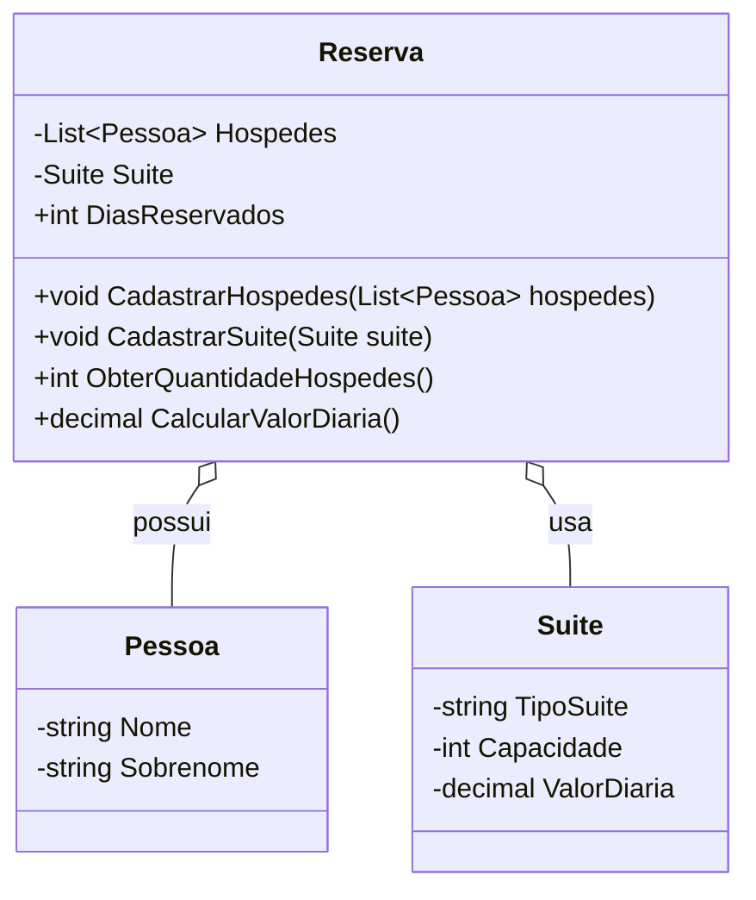

# Diagrama de classes (Mermaid)

Arquivo com o diagrama de classes em formato Mermaid para fácil visualização em ferramentas que suportam Mermaid (ex.: GitHub, VS Code Mermaid Preview, etc.).

Notas:
- `Reserva` agrega `Pessoa` e usa `Suite`.
- Os métodos públicos apresentados refletem a API principal implementada em `HospedagemHotel/Models/Reserva.cs`.
